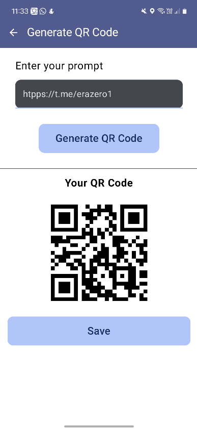
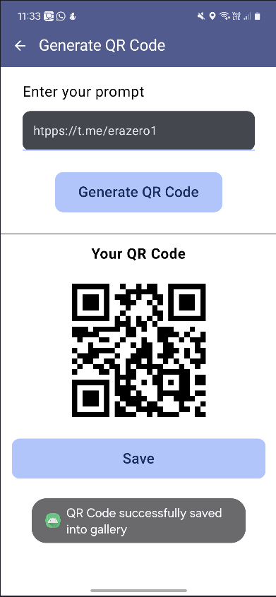

# QR Code Scanner & Generator App

A modern Android application built with **Jetpack Compose**, following **Clean Architecture** principles. This app allows users to **scan** QR codes using **Google Play Services Code Scanner** and **generate** custom QR codes using `io.github.g0dkar:qrcode-kotlin`. It uses **Hilt** for dependency injection and **Kotlin Flow** for reactive data handling.

---

## 🚀 Features

- 📷 QR Code scanning using Play Services Code Scanner
- 🧾 QR Code generation using `qrcode-kotlin`
- 🧭 Navigation with Jetpack Compose Navigation
- 🧱 Clean Architecture structure (Presentation, Domain, Data)
- ⚙️ Dependency Injection with Hilt
- 🔁 Reactive data flow with Kotlin Flow
- ✨ Built entirely with Jetpack Compose UI

---

## 🧱 Project Structure
app/
├── di/ # Hilt modules and DI setup
├── presentation/ # UI, ViewModels, and navigation
├── domain/ # Use cases and domain models
└── data/ # Repositories and data sources
---

## 🛠 Tech Stack

| Purpose              | Library / Tool                         |
|----------------------|----------------------------------------|
| UI                   | Jetpack Compose                        |
| Navigation           | Compose Navigation                     |
| Dependency Injection | Hilt                                   |
| Reactive Programming | Kotlin Flow                            |
| QR Scanner           | Play Services Code Scanner             |
| QR Generator         | io.github.g0dkar:qrcode-kotlin         |
| Architecture         | Clean Architecture                     |

---

## 📲 Getting Started

### Prerequisites
- Android Studio Hedgehog or newer
- Android device or emulator with Google Play Services

### Installation
1. Clone the repository:
    ```bash
    git clone https://github.com/erazero1/qr_code_app
    cd qr-scanner-generator
    ```

2. Open the project in Android Studio.

3. Build and run the app on a device/emulator.

---

## 📷 Screenshots





---

## 🔐 Permissions

The app requires the following permissions:
- `CAMERA` - for scanning QR codes

---

## 📚 Acknowledgements

- [Jetpack Compose](https://developer.android.com/jetpack/compose)
- [QRCode Kotlin](https://github.com/g0dkar/qrcode-kotlin)
- [Google ML Kit Barcode Scanner](https://developers.google.com/ml-kit/vision/barcode-scanning/android)

---

## 📄 License

This project is licensed under the MIT License. See the [LICENSE](LICENSE) file for details.
